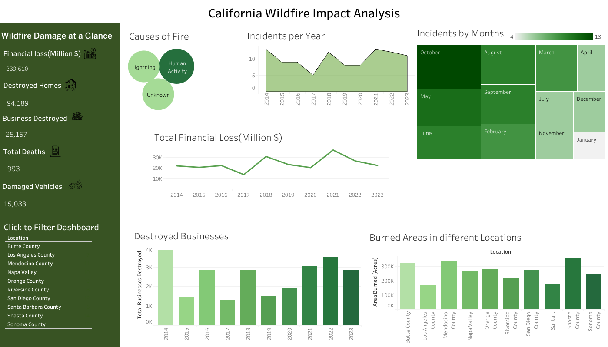

# California-Wildfire-Damage-Analysis

This project analyzes the impact of wildfires in California using Tableau and Power BI, focusing on trends, affected regions, and financial losses. It visualizes wildfire frequency, burned areas, and geographic distribution to identify high-risk zones and assess environmental and economic damage. The analysis provides data-driven insights to support decision-making for policymakers, environmentalists, and researchers.

